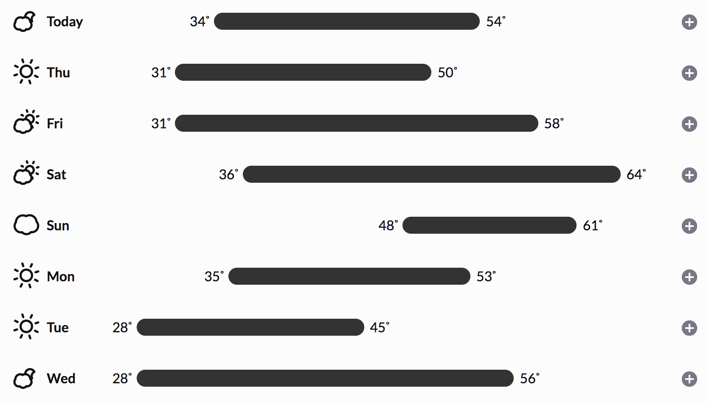
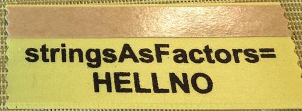

exclude: true

```{r, message=FALSE, warning=FALSE, include=FALSE}
options(
  htmltools.dir.version = FALSE, # for blogdown
  width=80
)

library(emo)
htmltools::tagList(rmarkdown::html_dependency_font_awesome())
```

---
class: middle
count: false

# Attributes

---

## Attributes

Attributes are metadata that can be attached to objects in R. Some are special (e.g. class, comment, dim, dimnames, names, etc.) and change the way in which an object is treated by R. 

Attributes are a named list that is attached to an R object, they can be accessed (get and set) individually via the `attr` and collectively via `attributes`.

```{r}
(x = c(L=1,M=2,N=3))
attr(x,"names") = c("A","B","C")
x
names(x)
```

---

## 

```{r}
str(x)
attributes(x)
str(attributes(x))
```

---

## Factors

Factor objects are how R stores data for categorical variables (fixed #s of discrete values).

```{r}
(x = factor(c("BS", "MS", "PhD", "MS")))
str(x)
typeof(x)
```

---

## 

A factor is just an integer vector with two attributes: `class` and `levels`.

```{r}
attributes(x)
```

---

## Exercise 1

Construct a factor variable (without using `factor`, `as.factor`, or related functions) that contains the weather forecast for the next 7 days.

<br/>

```{r out.width="60%", fig.align="center", echo=FALSE}

```

<br/>


* There should be 5 levels - `sun`, `partial clouds`, `clouds`, `rain`, `snow`.

* Start with an *integer* vector and add the appropriate attributes.


---
class: middle
count: false

# Data Frames

---

## Data Frames

A data frame is one of the most commonly used data structure in R, they are just a list of equal length vectors (usually atomic, but you can use generic as well). Each vector is treated as a column and elements of the vectors as rows.

Most often a data frame will be constructed by reading in from a file, but we can also create them from scratch.

```{r}
df = data.frame(x = 1:3, y = c("a", "b", "c"))
str(df)
```
---

```{r}
typeof(df)
attributes(df)
```

---

## Roll your own data.frame

```{r}
df2 = list(x = 1:3, y = factor(c("a", "b", "c")))
attr(df2,"class") = "data.frame"
attr(df2,"row.names") = 1:3
str(df2)
```

---

## Strings (Characters) vs Factors

By default R will convert character vectors into factors when they are included in a data frame. 

Sometimes this is useful, sometimes usually it isn't -- either way it is important to know what type/class you are working with. This behavior can be changed using the `stringsAsFactors` argument.

```{r}
df = data.frame(x = 1:3, y = c("a", "b", "c"), stringsAsFactors = FALSE)
str(df)
```
---

## Some general advice ...

<br/>
<br/>



---

## Length Coercion

As we have seen before, if a vector is shorter than expected, R will increase the length by repeating elements of the short vector. If the lengths are evenly divisible this will occur without any output / warning.

For data frames if the lengths are not evenly divisible then there will be an error.


```{r error=TRUE}
data.frame(x = 1:3, y = c("a"))
data.frame(x = 1:3, y = c("a","b"))
```
---

## Growing data frames 

We can add rows or columns to a data frame using `rbind` and `cbind` respectively.

```{r}
df = data.frame(x = 1:3, y = c("a","b","c"))
rbind(df, c(TRUE,FALSE))
```

```{r}
cbind(df, z=TRUE)
```

---

```{r}
df1 = data.frame(x = 1:3, y = c("a","b","c"))
df2 = data.frame(m = 3:1, n = c(TRUE,TRUE,FALSE))
cbind(df1,df2)
```

---

## Exercise 2

Construct a data frame that contains the following data (in as efficient a manner as possible). Hint - the `rep` function should prove useful.

```
  Patient    Gender          Treatment 1     Treatment 2     Treatment 3
---------- --------------- --------------- --------------- ---------------
  1          Male            Yes             Yes             Yes
  2          Male            Yes             Yes             No 
  3          Male            Yes             No              Yes
  4          Male            Yes             No              No
  5          Male            No              Yes             Yes
  6          Male            No              Yes             No
  7          Male            No              No              Yes
  8          Male            No              No              No
  9          Female          Yes             Yes             Yes 
  10         Female          Yes             Yes             No
  11         Female          Yes             No              Yes
  12         Female          Yes             No              No
  13         Female          No              Yes             Yes
  14         Female          No              Yes             No
  15         Female          No              No              Yes
  16         Female          No              No              No
```


---
class: middle
count: false

# Matrices

---

## Matrices

A matrix is a 2 dimensional equivalent of an atomic vector (i.e. all entries must share the same type).

```{r}
(m = matrix(c(1,2,3,4), ncol=2, nrow=2))

attributes(m)
```

---
class: split-50

## Column major ordering

A matrix is therefore just an atomic vector with a `dim` attribute where the data is stored in column major order (fill the first column starting at row one, then the next column and so on).

Data in a matrix is always stored in this format but we can fill by rows using the `byrow` argument

.column[
```{r}
(cm = matrix(c(1,2,3,4), 
             ncol=2, nrow=2))
c(cm)
```
]

.column[
```{r}
(rm = matrix(c(1,2,3,4), 
             ncol=2, nrow=2, 
             byrow=TRUE))
c(rm)
```
]


---
class: middle
count: false

# Subsetting

---

## Subsetting in General

R has several different subsetting operators (`[`, `[[`, and `$`).

The behavior of these operators will depend on the object they are being used with.

<br/>

--

In general there are 6 different data types that can be used to subset:

* Positive integers

* Negative integers

* Logical values

* Empty / NULL

* Zero

* Character values (names)

---
class: split-50

## Positive Integer subsetting

Returns elements at the given location(s) (*note R uses a 1-based not a 0-based indexing scheme*).

```{r}
x = c(1,4,7)
y = list(1,4,7)
```

.column[
```{r}
x[c(1,3)]
x[c(1,1)]
x[c(1.9,2.1)]
```
]

.column[
```{r}
str( y[c(1,3)] )
str( y[c(1,1)] )
str( y[c(1.9,2.1)] )
```
]

---
class: split-50

## Negative Integer subsetting

Excludes elements at the given location

.column[
```{r, error=TRUE}
x = c(1,4,7)
x[-1]
x[-c(1,3)]
x[c(-1,-1)]
```
]

.column[
```{r, error=TRUE}
y = list(1,4,7)
str( y[-1] )
str( y[-c(1,3)] )
```
]

<div style="clear: both;"></div>

```{r error=TRUE}
x[c(-1,2)]
```

---
class:split-50

## Logical Value Subsetting

Returns elements that correspond to `TRUE` in the logical vector. Length of the logical vector is expected to be the same of the vector being subsetted.

.column[
```{r}
x = c(1,4,7,12)
x[c(TRUE,TRUE,FALSE,TRUE)]
x[c(TRUE,FALSE)]
x[x %% 2 == 0]
```
]

.column[
```{r, error=TRUE}
y = list(1,4,7,12)
str( y[c(TRUE,TRUE,FALSE,TRUE)] )
str( y[c(TRUE,FALSE)] )
str( y[y %% 2 == 0] )
```
]

---

## Empty Subsetting

Returns the original vector.

```{r}
x = c(1,4,7)
x[]

y = list(1,4,7)
str(y[])
```

---
class: split-50

## Zero subsetting

Returns an empty vector of the same type as the vector being subseted.

.column[
```{r}
x = c(1,4,7)
x[0]

y = list(1,4,7)
str(y[0])
```
]

.column[
```{r}
x[c(0,1)]

y[c(0,1)]
```
]

---
class: split-50

## Character subsetting

If the vector has names, select elements whose names correspond to the character vector.

.column[
```{r}
x = c(a=1,b=4,c=7)
x["a"]
x[c("a","a")]
x[c("b","c")]
```
]

.column[
```{r}
y = list(a=1,b=4,c=7)
str(y["a"])
str(y[c("a","a")])
str(y[c("b","c")])
```
]

---
class: split-50

## Out of bound subsetting

.column[
```{r}
x = c(1,4,7)
x[4]
x["a"]
x[c(1,4)]
```
]

.column[
```{r}
y = list(1,4,7)
str(y[4])
str(y["a"])
str(y[c(1,4)])
```
]

---
class:split-50

## Missing and NULL subsetting

.column[
```{r}
x = c(1,4,7)
x[NA]
x[NULL]
x[c(1,NA)]
```
]

.column[
```{r}
y = list(1,4,7)
str(y[NA])
str(y[NULL])
str(y[c(1,NA)])
```
]

---

## Atomic vectors - [ vs. [[

`[[` subsets like `[` except it can only subset a single value. 

```{r, error=TRUE}
x = c(a=1,b=4,c=7)
x[[1]]
x[["a"]]
x[[1:2]]
```

---

## Generic Vectors - [ vs. [[

Subsets a single value, but returns the value - not a list containing that value.

```{r, error=TRUE}
y = list(a=1,b=4,c=7)
y[2]
y[[2]]
y[["b"]]
y[[1:2]]
```

---

## Hadley's Analogy

```{r echo=FALSE, fig.align="center", outwidth="80%"}
knitr::include_graphics("imgs/pepper_subset.png")
```

---

## [[ vs. $

`$` is equivalent to `[[` but it only works for named *lists* and it has a terrible default where it uses partial matching (`exact=FALSE`) to access the underlying value.

```{r, error=TRUE}
x = c("abc"=1, "def"=5)
x$abc
y = list("abc"=1, "def"=5)
y[["abc"]]
y$abc
y$d
```
---

## A common gotcha

Why does the following code not work?

```{r error=TRUE}
x = list(abc = 1:10, def = 10:1)
y = "abc"

x$y
```

--

$$ x$y \Leftrightarrow x[["y"]] \ne x[[y]] $$

```{r}
x[[y]]
```

---

## Exercise 3

Below are 100 values,

```{r}
x = c(56, 3, 17, 2, 4, 9, 6, 5, 19, 5, 2, 3, 5, 0, 13, 12, 6, 31, 10, 21, 8, 4, 1, 1, 2, 5, 16, 1, 3, 8, 1,
      3, 4, 8, 5, 2, 8, 6, 18, 40, 10, 20, 1, 27, 2, 11, 14, 5, 7, 0, 3, 0, 7, 0, 8, 10, 10, 12, 8, 82,
      21, 3, 34, 55, 18, 2, 9, 29, 1, 4, 7, 14, 7, 1, 2, 7, 4, 74, 5, 0, 3, 13, 2, 8, 1, 6, 13, 7, 1, 10,
      5, 2, 4, 4, 14, 15, 4, 17, 1, 9)
```

write down how you would create a subset to accomplish each of the following:

* Select every third value starting at position 2 in `x`.

* Remove all values with an odd index (e.g. 1, 3, etc.)

* Remove every 4th value, but only if it is odd.

---
class: middle
count: false

# Subsetting Matrices, Data Frames, and Arrays

---

## Subsetting Matrices

```{r}
(x = matrix(1:6, nrow=2, ncol=3))
```

.column[
```{r}
x[1,3]
x[1:2, 1:2]
```
]

.column[
```{r}
x[, 1:2]
x[-1,-3]
```
]

---
class: split-50

## Preserving Subsetting

By default R's `[` subset operator is a *preserving* subset operator, in that the returned object will have the same type as the parent. Confusingly, when used with a matrix or array `[` becomes a *simplifying* operator (does not preserve type) - this behavior can be controlled by the `drop` argument.

.column[
```{r}
x[1, ]
x[1, , drop=TRUE]
x[1, , drop=FALSE]
```
]

.column[
```{r}
str(x[1, ])
str(x[1, , drop=TRUE])
str(x[1, , drop=FALSE])
```
]

---

## Preserving vs Simplifying Subsets

Type           |  Simplifying             |  Preserving
:--------------|:-------------------------|:------------------------------------------------------
Atomic Vector  |  `x[[1]]`                |  `x[1]`
List           |  `x[[1]]`                |  `x[1]`
Matrix / Array |  `x[1, ]` <br/> `x[, 1]` |  `x[1, , drop = FALSE]` <br/> `x[, 1, drop = FALSE]`
Factor         |  `x[1:4, drop = TRUE]`   |  `x[1:4]`
Data frame     |  `x[, 1]` <br/> `x[[1]]` |  `x[, 1, drop = FALSE]` <br/> `x[1]`

---

## Factor Subsetting

```{r}
(x = factor(c("BS", "MS", "PhD", "MS")))
x[1:2]
x[1:2, drop=TRUE]
```
---

## Data Frame Subsetting

If provided with a single value, data frames assume you want to subset a column or columns - multiple values then the data frame is treated as a matrix.

```{r}
df = data.frame(a = 1:2, b = 3:4)
df[1]
df[[1]]
df[, "a"]
```

---

## 

```{r}
df["a"]
df[, "a", drop = FALSE]
df[1,]
df[c("a","b","a")]

```

---
class: middle
count: false

# Subsetting and assignment

---

## Subsetting and assignment

Subsets can also be used with assignment to update specific values within an object.

```{r}
x = c(1, 4, 7)
```

```{r}
x[2] = 2
x
x[x %% 2 != 0] = x[x %% 2 != 0] + 1
x
x[c(1,1)] = c(2,3)
x
```

---
class: split-50

## 

.column[
```{r}
x = 1:6
x[c(2,NA)] = 1
x
```

```{r}
x = 1:6
x[c(TRUE,NA)] = 1
x
```
]

.column[
```{r}
x = 1:6
x[c(-1,-3)] = 3
x
```

```{r}
x = 1:6
x[] = 6:1
x
```
]

---

## Deleting list (df) elements

```{r}
df = data.frame(a = 1:2, b = TRUE, c = c("A", "B"))
```

```{r}
df[["b"]] = NULL
str(df)
```

```{r}
df[,"c"] = NULL
str(df)
```

---

## Subsets of Subsets

```{r}
df = data.frame(a = c(5,1,NA,3))
```

```{r}
df$a[df$a == 5] = 0
df[["a"]][df[["a"]] == 1] = 0
df[1][df[1] == 3] = 0
```

```{r}
df
```

---

## Acknowledgments

Above materials are derived in part from the following sources:

* Hadley Wickham - [Advanced R](http://adv-r.had.co.nz/)
* [R Language Definition](http://stat.ethz.ch/R-manual/R-devel/doc/manual/R-lang.html)
