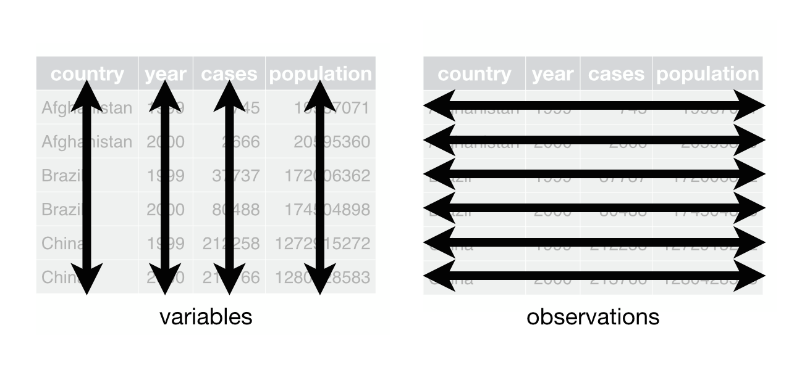
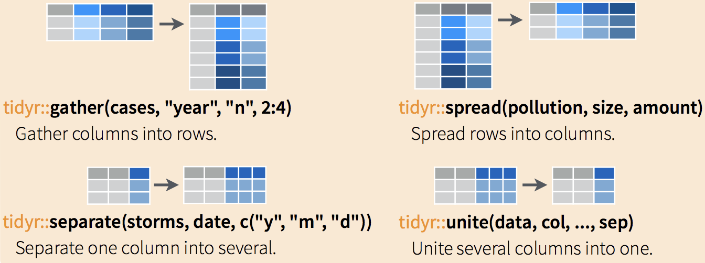

exclude: true

```{r, message=FALSE, warning=FALSE, include=FALSE}
options(
  htmltools.dir.version = FALSE, # for blogdown
  width = 80,
  tibble.width = 80
)

library(emo)
htmltools::tagList(rmarkdown::html_dependency_font_awesome())

library(dplyr)
library(purrr)
library(tidyr)
library(magrittr)
```


---
class: middle
count: false

# tidyr

---

## Tidy data

.footnote[ 
From R4DS - [tidy data](r4ds.had.co.nz/tidy-data.html)
]

```{r echo=FALSE, out.width="100%"}

```

---

## Tidy?

```{r message=FALSE}
tb = readr::read_csv(paste0("https://github.com/tidyverse/",
                            "tidyr/raw/master/vignettes/tb.csv"))

tb
```

---
## Codebook

| Column | Meaning             |
|--------|:--------------------|
| `iso2` |  2 digit iso country code
| `year` |  year
| `m04`  |  Males, 0 - 4
| `m514` |  Males, 5 - 14
| `m014` |  Males, 0 - 14
| ...    | ...
| `m65`  |  Males, 65+
| `mu`   |  Males, unknown
| ...    | ...

---

## Fixing things with tidyr

.footnote[
From RStudio's [Data Wrangling Cheat Sheet](https://www.rstudio.com/wp-content/uploads/2015/02/data-wrangling-cheatsheet.pdf)
]

.center[
```{r echo=FALSE, out.width="15%"}
knitr::include_graphics('imgs/hex-tidyr.png')
```
]


```{r echo=FALSE, out.width="100%"}

```

---

## Moving columns to rows

.pull-left[
```{r}
tb %>% 
  gather(
    group, counts, 
    -iso2, -year
  )
```
]

.pull-right[
```{r}
tb %>% 
  gather(
    group, counts, 
    -iso2, -year, na.rm = TRUE
  )
```
]

---

## Moving columns to rows

```{r}
tb %>% 
  gather(group, counts, -iso2, -year, na.rm = TRUE) %>%
  separate(group, into = c("gender","age"), 1)
``` 

---

## Fixing ages

```{r}
(tb = tb %>% 
  gather(group, counts, -iso2, -year, na.rm=TRUE) %>%
  separate(group, into = c("gender","age"), 1) %>%
  mutate(
    age = case_when(
      age == "04" ~ "0-4",     age == "514" ~ "5-14",
      age == "014" ~ "0-14",   age == "1524" ~ "15-24",
      age == "2534" ~ "25-34", age == "3544" ~ "35-44",
      age == "4554" ~ "45-54", age == "5564" ~ "55-64",
      age == "65" ~ "65+",     age == "u" ~ NA_character_
    )
  )
)
``` 

---

## Moving rows to columns

```{r}
tb %>%
  spread(gender, counts) %>%
  mutate(total = m + f)
```

---

## Example 1

The `line` data set is an example included in the `coda` package containing mcmc posterior samples from a linear regression model. Use `tidyr` to adjust the data frame such that you can use `ggplot2` to create trace plots.

```{r}
library(coda)
data(line,package = "coda")
d = as_data_frame(line$line1)

d
```


---
class: middle
count: false

# Functional Programming

---

## Functional Programming

<br/>

.medium[

* First order functions 

* Pure functions

* Anonymous functions

* Vectorized functions

* *Closures*

* *Recursion*

]

---
class: middle
count: false

# Apply functions

---

## Apply functions

The apply functions are a collection of tools for functional programming in R, they are variations of the `map` function found in many other languages

```{r, eval=FALSE}
??apply
---

## 
---

## Help files with alias or concept or title matching ‘apply’ using fuzzy
---

## matching:
---

## 
---

## base::apply             Apply Functions Over Array Margins
---

## base::.subset           Internal Objects in Package 'base'
---

## base::by                Apply a Function to a Data Frame Split by Factors
---

## base::eapply            Apply a Function Over Values in an Environment
---

## base::lapply            Apply a Function over a List or Vector
---

## base::mapply            Apply a Function to Multiple List or Vector Arguments
---

## base::rapply            Recursively Apply a Function to a List
---

## base::tapply            Apply a Function Over a Ragged Array
```

---

## lapply

Usage: `lapply(X, FUN, ...)`

`lapply` returns a list of the same length as `X`, each element of which is the result of applying `FUN` to the corresponding element of `X`.

<br/>

.pull-left[
```{r}
lapply(1:8, sqrt) %>% str()
```
]

.pull-right[
```{r}
lapply(1:8, function(x) (x+1)^2) %>% str()
```
]

---

```{r}
lapply(1:8, function(x, pow) x^pow, pow=3) %>% str()
lapply(1:8, function(x, pow) x^pow, x=2) %>% str()
```

---

## sapply

Usage: `sapply(X, FUN, ..., simplify = TRUE, USE.NAMES = TRUE)`

`sapply` is a *user-friendly* version and wrapper of `lapply`, it is a *simplifying* version of lapply. Whenever possible it will return a vector, matrix, or an array.

<br/>

```{r}
sapply(1:8, sqrt)
sapply(1:8, function(x) (x+1)^2)
```

---

```{r}
sapply(1:8, function(x) c(x, x^2, x^3, x^4))
sapply(1:8, function(x) list(x, x^2, x^3, x^4))
```

---

```{r}
sapply(2:6, seq)
```

---

## [ls]apply and data frames

We can use these functions with data frames, the key is to remember that a data frame is just a fancy list.

```{r}
df = data.frame(a = 1:6, b = letters[1:6], c = c(TRUE,FALSE))
lapply(df, class) %>% str()
sapply(df, class)
```

---

## other less common applies

* `apply(X, MARGIN, FUN, ...)` - applies a function over the rows or columns of a data frame, matrix or array

* `vapply(X, FUN, FUN.VALUE, ..., USE.NAMES = TRUE)` - is similar to `sapply`, but has a enforced return type and size

* `mapply(FUN, ..., MoreArgs = NULL, SIMPLIFY = TRUE, USE.NAMES = TRUE)` -  like `sapply` but will iterate over multiple vectors at the same time.

* `rapply(object, f, classes = "ANY", deflt = NULL, how = c("unlist", "replace", "list"), ...)` - a recursive version of `lapply`, behavior depends largely on the `how` argument

* `eapply(env, FUN, ..., all.names = FALSE, USE.NAMES = TRUE)` -  apply a function over an environment.

---

## Example 2

Below is the list of primes between 2 and 100:

```{r eval=FALSE}
c( 2,  3,  5,  7, 11, 13, 17, 19, 23, 29, 31, 37,
  43, 47, 53, 59, 61, 67, 71, 73, 79, 83, 89, 97)
```

If you were given the vector `c(3, 4, 12, 19, 23, 48, 50, 61, 63, 78)`, write out the R code necessary to return only the values of the vector that are *not* prime using

* a for loop

* subsetting

* an apply function


---
class: middle
count: false

# purrr

---

## purrr

.center[
```{r echo=FALSE}
knitr::include_graphics("imgs/purrr.png")
```
]


A tidyverse package which improves the functional programming tools in R, it focuses on *pure* and *type stable* functions.


---

## Map functions

Basic functions for looping over an object and returning a value (of a specific type) - replacement for `lapply`/`sapply`/`vapply`.

* `map()` - returns a list.

* `map_lgl()` - returns a logical vector.

* `map_int()` - returns a integer vector.

* `map_dbl()` - returns a double vector.

* `map_chr()` - returns a character vector.

* `map_df()` / `map_dfr()` - returns a data frame by row binding.

* `map_dfc()` - returns a data frame by column binding.

* `walk()` - returns nothing, call function exclusively for its side effects


---

## Type Consistency

R is a weakly / dynamically typed language which means there is no simple way to define a function which enforces the argument or return types.

This flexibility can be useful at times, but often it makes it hard to reason about your code and requires more verbose code to handle edge cases.

```{r}
x = list(rnorm(1e3),rnorm(1e3),rnorm(1e3))
```
```{r}
map_dbl(x, mean)
```
```{r}
map_chr(x, mean)
```
```{r error=TRUE}
map_int(x, mean)
```

---

## Shortcut - Anonymous Functions

An anonymous function is one that is never given a name (assigned to a variable)

```{r}
sapply(1:5, function(x) x^(x+1))
```

purrr lets us write anonymous functions using one sided formulas where the first arguments 

```{r}
map_dbl(1:5, ~ .^(.+1))
```

```{r}
map_dbl(1:5, ~ .x^(.x+1))
```

```{r}
map2_dbl(1:5, 1:5, ~ .x^(.y+1))
```

---

## Purrr shortcut - Lookups

Very often we want to extract only certain (named) values from a list, `purrr` provides a shortcut for this operation when you provide either a character or numeric value instead of a function to apply.


```{r}
x = list(list(a=1L,b=2L,c=list(d=3L,e=4L)),
         list(a=5L,b=6L,c=list(d=7L,e=8L,f=9L)))
```     

--

.pull-left[
```{r}
map_int(x, "a")
map_dbl(x, c("c","e"))
map_chr(x, list(3,"d"))
```
]

--

.pull-right[
```{r}
map_df(x, 3)
map_dfc(x, 3)
```
]


---

```{r}
x = list(list(a=1L,b=2L,c=list(d=3L,e=4L)),
         list(a=5L,b=6L,c=list(d=7L,e=8L,f=9L)))
``` 

```{r error=TRUE}
map(x, list(3,"f"))

map_int(x, list(3,"f"))

map_int(x, list(3,"f"), .default=NA)
```

---

## Example 3

Using the `sw_people` data set in the `repurrrsive` package, generate a tidy data frame (tibble) containing as many details as possible.

```{r}
library(repurrrsive)
```

.pull-left[
```{r}
str(sw_people,max.level = 1)
```
]

.pull-right[
```{r}
str(sw_people,max.level = 2)
```
]


---
class: middle
count: false

# Acknowledgments

---

## Acknowledgments

Above materials are derived in part from the following sources:

* Hadley Wickham - [Adv-R Functionals](http://adv-r.had.co.nz/Functionals.html)

* Hadley Wickham - [R for Data Science](http://r4ds.had.co.nz/)

* Neil Saunders - [A brief introduction to "apply" in R](http://nsaunders.wordpress.com/2010/08/20/a-brief-introduction-to-apply-in-r/)

* Jenny Bryan - [Purrr Tutorial](https://jennybc.github.io/purrr-tutorial/)

* [R Language Definition](http://stat.ethz.ch/R-manual/R-devel/doc/manual/R-lang.html)


